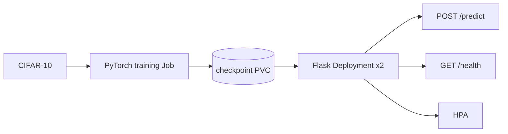

# MLOps PyTorch Pipeline

Minimal CIFAR-10 image-classification pipeline for Docker and Kubernetes.



## Local training (no Docker)

```bash
python -m pytest -q
python src/train.py --config configs/training_config.yaml
```

Override the config path with `TRAINING_CONFIG`. Checkpoints are written under
`output.checkpoint_dir` from the YAML file.

## Run locally with Docker

The training image downloads CIFAR-10 into the mounted `data` directory and
writes the best early-stopped checkpoint to `checkpoints`.

```bash
docker build -f docker/Dockerfile.train -t mlops-train:v1 .
docker run --rm -v "$PWD/data:/app/data" -v "$PWD/checkpoints:/app/checkpoints" mlops-train:v1
docker build -f docker/Dockerfile.serve -t mlops-serve:v1 .
docker run --rm -p 8080:8080 -v "$PWD/checkpoints:/app/checkpoints" mlops-serve:v1
curl http://localhost:8080/health
curl -X POST http://localhost:8080/predict -F image=@test_image.png
```

Generate a sample image with `python scripts/make_test_image.py`. Dependencies
are pinned in `requirements/`; `pytest -q` runs the model tests.

## Kubernetes

Build the images in the local Minikube context (or push them to a registry),
then apply:

```bash
kubectl apply -f k8s/namespace.yaml
kubectl apply -f k8s/pvc.yaml
kubectl apply -f k8s/configmap.yaml
kubectl apply -f k8s/secret.yaml
kubectl apply -f k8s/training-job.yaml
kubectl wait --for=condition=complete job/model-training -n ml-training --timeout=30m
kubectl apply -f k8s/serving-deployment.yaml
kubectl apply -f k8s/serving-service.yaml
kubectl apply -f k8s/hpa.yaml
kubectl get pods -n ml-training
kubectl describe deployment model-serving -n ml-training
kubectl port-forward svc/model-serving 8080:80 -n ml-training
curl -X POST http://localhost:8080/predict -F image=@test_image.png
```

The PVCs use `ReadWriteOnce` for default Minikube storage. Apply
`k8s/secret.yaml` before the serving Deployment so `CHECKPOINT_PATH` is set.

## Git and submission checklist

```bash
git init
git branch -M main
git checkout -b develop
git checkout -b feature/model
git add . && git commit -m "feat: add pytorch classifier"
```

Push `main` and `develop` to a public GitHub repository named
`mlops-pytorch-pipeline`. Complete work on feature branches and merge at least
two meaningful PRs in each week, including terminal output/screenshots from
the Docker and Kubernetes commands above in the final PR.

## Reflection

The most challenging part was connecting three environments with different
assumptions: a local Python process, a Docker container, and a Kubernetes pod.
The training code therefore takes its configuration from a command-line
argument or `TRAINING_CONFIG`, while the default paths match the mounted
container volumes. This keeps local execution simple and lets the ConfigMap
control the Kubernetes run without rebuilding the image.

The model is intentionally a small CNN instead of a large pretrained network.
It is sufficient for demonstrating the lifecycle and keeps CPU training and
the serving image practical. Validation loss selects the checkpoint and an
early-stopping counter prevents unnecessary epochs. JSON-lines logging makes
each epoch easy to consume in container logs or a future monitoring system.

The serving process loads one checkpoint at startup. `/health` returns success
only after loading has succeeded, so Kubernetes does not route traffic to an
unready pod. The read-only checkpoint mount prevents inference replicas from
changing the model. A rolling update with two replicas maintains availability,
and the HPA provides a simple scale-out policy under CPU load.

The remaining operational work is environment-specific: a public GitHub
repository, four merged PRs, a cluster with suitable PVC support, and command
screenshots cannot be created reliably without the owner’s GitHub credentials,
Docker daemon, and cluster. The included workflow, commands, and manifests
make those final verification steps reproducible.
